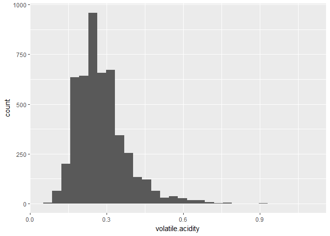
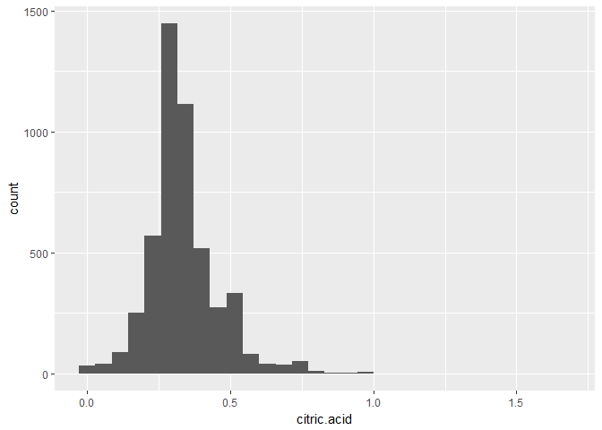

# Introduction

In this report, I explored a dataset containing the chemical properties of 4898 
white wines and their quality ratings on a scale of 0 to 10. The aim of this 
exploratory data analysis is to determine chemical properties that influence 
the quality of white wines.

### Structure of data


```
## 'data.frame':	4898 obs. of  13 variables:
##  $ X                   : int  1 2 3 4 5 6 7 8 9 10 ...
##  $ fixed.acidity       : num  7 6.3 8.1 7.2 7.2 8.1 6.2 7 6.3 8.1 ...
##  $ volatile.acidity    : num  0.27 0.3 0.28 0.23 0.23 0.28 0.32 0.27 0.3 0.22 ...
##  $ citric.acid         : num  0.36 0.34 0.4 0.32 0.32 0.4 0.16 0.36 0.34 0.43 ...
##  $ residual.sugar      : num  20.7 1.6 6.9 8.5 8.5 6.9 7 20.7 1.6 1.5 ...
##  $ chlorides           : num  0.045 0.049 0.05 0.058 0.058 0.05 0.045 0.045 0.049 0.044 ...
##  $ free.sulfur.dioxide : num  45 14 30 47 47 30 30 45 14 28 ...
##  $ total.sulfur.dioxide: num  170 132 97 186 186 97 136 170 132 129 ...
##  $ density             : num  1.001 0.994 0.995 0.996 0.996 ...
##  $ pH                  : num  3 3.3 3.26 3.19 3.19 3.26 3.18 3 3.3 3.22 ...
##  $ sulphates           : num  0.45 0.49 0.44 0.4 0.4 0.44 0.47 0.45 0.49 0.45 ...
##  $ alcohol             : num  8.8 9.5 10.1 9.9 9.9 10.1 9.6 8.8 9.5 11 ...
##  $ quality             : int  6 6 6 6 6 6 6 6 6 6 ...
```

This dataset contains 4898 observations with 13 variables. X refers to the 
wine's ID.

As ID is not needed for this analysis, I removed the column from the dataset.

```
## 'data.frame':	4898 obs. of  12 variables:
##  $ fixed.acidity       : num  7 6.3 8.1 7.2 7.2 8.1 6.2 7 6.3 8.1 ...
##  $ volatile.acidity    : num  0.27 0.3 0.28 0.23 0.23 0.28 0.32 0.27 0.3 0.22 ...
##  $ citric.acid         : num  0.36 0.34 0.4 0.32 0.32 0.4 0.16 0.36 0.34 0.43 ...
##  $ residual.sugar      : num  20.7 1.6 6.9 8.5 8.5 6.9 7 20.7 1.6 1.5 ...
##  $ chlorides           : num  0.045 0.049 0.05 0.058 0.058 0.05 0.045 0.045 0.049 0.044 ...
##  $ free.sulfur.dioxide : num  45 14 30 47 47 30 30 45 14 28 ...
##  $ total.sulfur.dioxide: num  170 132 97 186 186 97 136 170 132 129 ...
##  $ density             : num  1.001 0.994 0.995 0.996 0.996 ...
##  $ pH                  : num  3 3.3 3.26 3.19 3.19 3.26 3.18 3 3.3 3.22 ...
##  $ sulphates           : num  0.45 0.49 0.44 0.4 0.4 0.44 0.47 0.45 0.49 0.45 ...
##  $ alcohol             : num  8.8 9.5 10.1 9.9 9.9 10.1 9.6 8.8 9.5 11 ...
##  $ quality             : int  6 6 6 6 6 6 6 6 6 6 ...
```

# Univariate Plots Section

### Quality

<!-- -->

Most wines have a quality rating between 5 to 7 and the most common rating is 6.

### Fixed Acidity

Summary of fixed acidity data:


```
##    Min. 1st Qu.  Median    Mean 3rd Qu.    Max. 
##   3.800   6.300   6.800   6.855   7.300  14.200
```

<!-- -->

<!-- -->

Fixed acitity data is normally ditributed. Most wines have a fixed acidity 
level between 6 to 7.5 g/dm^3^. There are also some high outliers.

I discovered from online resources that acids affect the mouth feel of wines, 
so I am curious whether fixed acidity, which measures the concentration of 
tartaric acid in wines, is linked to wine quality.

## Volatile Acidity

Summary of volatile acidity data:


```
##    Min. 1st Qu.  Median    Mean 3rd Qu.    Max. 
##  0.0800  0.2100  0.2600  0.2782  0.3200  1.1000
```

<!-- -->

<!-- -->

Volatile acidity data, which is the measure of acetic acid concentration, is 
slightly right-skewed. Most wines have a volatile acidity between 0.15 to 0.35 
g/dm^3^ and there are some high outliers. According to the documentation in 
`wineQualityInfo.txt`, high volatile acidity can give wines an unpleasant, 
vinegar taste, so I wonder if volatile acidity is negatively correlated to 
quality.

### Citric Acid

Summary of citric acid data:


```
##    Min. 1st Qu.  Median    Mean 3rd Qu.    Max. 
##  0.0000  0.2700  0.3200  0.3342  0.3900  1.6600
```

<!-- -->

<!-- -->

Citric acid levels are quite normally distributed and most wines have citric 
acid level between 0.20 to 0.40 g/dm^3^. However, there are also many wines 
with 0.49 g/dm^3^ citric acid. In addition, there are some high outliers.

According to the documentation in `wineQualityInfo.txt`, citric acid can add 
freshness and flavor to wines, so I wonder if citric acid levels affect the 
quality ratings.

### Residual Sugar

Summary of residual sugar data:


```
##    Min. 1st Qu.  Median    Mean 3rd Qu.    Max. 
##   0.600   1.700   5.200   6.391   9.900  65.800
```

<!-- -->

Most wines have residual sugar levels of 20 g/dm^3^ and below.

<!-- -->

The residual sugar data is right-skewed and has a very long right tail. So, I 
transformed the scale into log scale.

<!-- -->

The transformed residual sugar distribution appears to be bimodal and peaks 
around 1.5 g/dm^3^ and 8 g/dm^3^.

Residual sugar level probably affects the sweetness of wines, so I am curious 
whether it is correlated to quality rating.

### Chlorides

Summary of cholrides data:


```
##    Min. 1st Qu.  Median    Mean 3rd Qu.    Max. 
## 0.00900 0.03600 0.04300 0.04577 0.05000 0.34600
```


<!-- -->

<!-- -->

Chlorides appear to be normally distributed. Most wines have chlorides level 
between 0.25 to 0.55 g/dm^3^. There are also some high outliers.

### Free Sulfur Dioxide

Summary of free sulfur dioxide data:

<!-- -->

<!-- -->

The free sulfur dioxide data is slightly right-skewed. Most wines have free 
sulfur dioxide levels between 20 to 40 mg/dm^3^. There are also a few high 
outliers.

### Free Sulfur Dioxide Bucket

According to the documentation `wineQualityInfo.txt`, if free sulfur dioxide in 
wine is higher than 50 ppm, it gives an obvious smell and taste in the wine. 
So, I wonder if wines with free sulfur dioxide levels higher than 50 mg/dm^3^ 
have a different rating from those below (assuming 1 mg/dm^3^ is approximately 
1ppm). To investigate this, I created a column called 
free.sulfur.dioxide.bucket where wines with free sulfur dioxide levels higher 
than 50 mg/dm^3^ will be assigned the value ">50" and those lower than or 
equal to 50 mg/dm^3^ will be assigned the value "<=50".


```r
df$free.sulfur.dioxide.bucket <- ifelse(df$free.sulfur.dioxide > 50,
                                        ">50", "<=50")

str(df$free.sulfur.dioxide.bucket)
```

```
##  chr [1:4898] "<=50" "<=50" "<=50" "<=50" "<=50" "<=50" "<=50" "<=50" ...
```

<!-- -->

There are much more wines with free sulfur dioxide levels less than or equal to 
50 mg/dm^3^ compared to those with free sulfur dioxide levels more than 50 
mg/dm^3^.

### Total Sulfur Dioxide

Summary of total sulfur dioxide data:


```
##    Min. 1st Qu.  Median    Mean 3rd Qu.    Max. 
##     9.0   108.0   134.0   138.4   167.0   440.0
```

<!-- -->

The total sulfur dioxide data is slightly right-skewed. Most wines have total 
sulfur dioxide levels between 75 to 175 mg/dm^3^.

### Density

Summary of density data:


```
##    Min. 1st Qu.  Median    Mean 3rd Qu.    Max. 
##  0.9871  0.9917  0.9937  0.9940  0.9961  1.0390
```

<!-- -->

<!-- -->

Desnsity data is slightly right-skewered. Most wines have densities between 
0.9900 to 0.9975 g/cm^3^. There are also some high outliers.

### pH

Summary of pH data:


```
##    Min. 1st Qu.  Median    Mean 3rd Qu.    Max. 
##   2.720   3.090   3.180   3.188   3.280   3.820
```

<!-- -->

pH data is normally distributed. Most wines have a pH level between 3.00 to 
3.35.

## Sulphates

Summary of sulphates data:


```
##    Min. 1st Qu.  Median    Mean 3rd Qu.    Max. 
##  0.2200  0.4100  0.4700  0.4898  0.5500  1.0800
```

<!-- -->

<!-- -->

The sulphates data is slightly right-skewed. Most wines have sulphates levels 
between 0.35 to 0.55 g/dm^3^.

## Alcohol

Summary of alcohol data:


```
##    Min. 1st Qu.  Median    Mean 3rd Qu.    Max. 
##    8.00    9.50   10.40   10.51   11.40   14.20
```


<!-- -->

Alcohol data is right-skewed. Most wines have alcohol levels between 9 to 11.5%.

I found from some online resources that alcohols affect the taste of wines, so 
I am curious whether alcohol levels influence the quality ratings.

As sugar is converted to alcohol during wine fermentation process, having high 
alcohol content could mean that a greater amount of sugar has been converted 
to alcohol. So, I wonder if there is an inverse relationship between the 
alcohol level and residual sugar.

# Univariate Analysis

### What is the structure of your dataset?

* There are 4898 wines in this dataset with 12 variables, which include 11 chemical properties and a quality rating.
* All the variables are either normally distributed or right-skewed.
* The most common quality rating is 6.

### What is/are the main feature(s) of interest in your dataset?

After some online research, I found that sugars and alcohols affect the taste 
of wines.

The main features of interest are quality rating, residual sugar, and alcohol. 
It will be interesting to find out how the ratings are affected by residual 
sugar and alcohol levels.

Other than that, I am also curious about whether alcohol level is residual 
sugar level are correlated.

### What other features in the dataset do you think will help support your \
investigation into your feature(s) of interest?

According to online resources, acids probably influence the mouth feel of 
wines, so the three acidity properties (fixed acidity, volatile acidity, and 
citric acid) could be somewhat related to quality ratings.

In addition, I suspect that pH could also affect the taste of wines. For 
example, Wines with lower pH would probably taste more sour. So, I think it 
will be good to investigate the relationship between pH and quality.

According to the documentation, if free sulfur dioxide in wine is higher than 
50 ppm, the it give an obvious smell and taste. So, I wonder if wines with 
free sulfur dioxide levels higher than 50 mg/dm^3^ have a different rating 
from those below 50 mg/dm^3^ (assuming 1 mg/dm^3^ is approximately 1ppm).

### Did you create any new variables from existing variables in the dataset?

I created a variable called free.sulfur.dioxide.bucket. In this column, wines 
with free sulfur dioxide levels higher than 50 mg/dm^3^ are assigned the value 
">50" and those lower than or equal to 50 mg/dm^3^ are assigned the value 
"<=50".

### Of the features you investigated, were there any unusual distributions? \
Did you perform any operations on the data to tidy, adjust, or change the \
form of the data? If so, why did you do this?

The residual sugar data has a very long tail, so I log-transformed the data. 
After doing so, the data appears bimodal.

# Bivariate Plots Section

### Correlation matrix

<!-- -->

Looking at the correlation matrix generated from a subset of data, only alcohol 
level is moderately correlated to quality. Residual sugar, fixed acidity, 
volatile acidity, citric acid, and pH have weak correlations with quality.

Other than that, there is also a moderate negative correlation betweeen 
residual sugar and alcohol level.

To get a better understanding of the relationships, I will take a closer look 
at individual bivariate plots.

### Quality and Alcohol

<!-- -->

Pearson correlation coefficient:


```
## [1] 0.4355747
```

There is a moderate positive correlation between alcohol level and quality. 
Wines with higher alcohol levels tend to have higher quality ratings.

Next, I take a look at the median alcohol level for wines at each quality 
rating.

<!-- -->

It seems that wines with quality ratings greater than 6 tend to have higher 
alcohol contents, while those with ratings 6 and below varied in alcohol 
contents.

### Quality and Residual Sugar

<!-- -->

<!-- -->

It seems that residual sugar is not really correlated to quality. The quality 
ratings are varied regardless of residual sugar level.

### Quality and Fixed Acidity

<!-- -->

### Quality and Volatile Acidity

<!-- -->

### Quality and Citric Acid Level

<!-- -->

It seems that fixed acidity, volatile acidity, and citric acid level are not 
really correlated with quality.

### Quality and pH

<!-- -->

Again, there appears to be not much correlation between pH and quality.

### Free Sulfur Dioxide and Quality

<!-- -->

At first glance, the box plots seem unusual. It seems that there is no median 
and the quality ratings for wines in both groups have the same first and third 
quartile. So, I check the summary of quality ratings in both groups.

Summary of quality ratings of wine with more than 50 mg/dm^3^ free sulfur 
dioxide:


```
##    Min. 1st Qu.  Median    Mean 3rd Qu.    Max. 
##   3.000   5.000   6.000   5.705   6.000   9.000
```

Summary of quality ratings of wine with less than or equal to 50 mg/dm^3^ free 
sulfur dioxide:


```
##    Min. 1st Qu.  Median    Mean 3rd Qu.    Max. 
##   3.000   5.000   6.000   5.915   6.000   9.000
```

It appears that both groups have the same five number summary (minimum, first 
quartile, median, third quartile, maximum) in terms of quality ratings. The 
median and third quartile also have the same values in both groups. As a 
result, the lines that represent median and third quartile overlap each other 
and thus the median line cannot be seen.

### Residual Sugar and Alcohol

<!-- -->

Pearson correlation coefficient (when log transformed):


```
## [1] -0.3934608
```

<!-- -->

Pearson correlation coefficient (when not log transformed):


```
## [1] -0.4506312
```

It seems that there is some negative correlation between residual sugar and 
alcohol. Wines with higher residual sugar levels tend to have lower alcohol 
levels. The correlation is stronger when residual sugar data is not log 
transformed.

# Bivariate Analysis

### Talk about some of the relationships you observed in this part of the \
investigation. How did the feature(s) of interest vary with other features in \
the dataset?

Among the variables investigated, only alcohol level seem to be somewhat 
correlated to quality. There is a moderate positive correlation between alcohol 
level and quality. Other than that, residual sugar, fixed acidity, volatile 
acidity, citric acid, pH, and free sulfur dioxide do not seem to be correlated 
to quality.

### Did you observe any interesting relationships between the other features \
(not the main feature(s) of interest)?

There is a moderate negative correlation between residual sugar level and 
alcohol level. Wines with higher residual sugar levels tend to have lower 
alcohol levels.

### What was the strongest relationship you found?

Alcohol level has the strongest correlation with quality. However, they are 
only moderately correlated.

# Multivariate Plots Section

<!-- -->

<!-- -->

It seems that the trend is similar in both groups. Wines with higher alcohol 
levels tend to have higher quality ratings.

<!-- -->

At the same quality rating, wines with greater than 50 mg/dm^3^ free sulfur 
dioxide tend to have lower alcohol levels. However, in both groups, wines with 
higher quality ratings still tend to have higher alcohol levels.

# Multivariate Analysis

### Talk about some of the relationships you observed in this part of the \
investigation. Were there features that strengthened each other in terms of \
looking at your feature(s) of interest?

Regardless of whether free sulfur dioxide is greater than 50 mg/dm^3^ or not, 
wines with higher quality ratings still tend to have higher alcohol levels.

### Were there any interesting or surprising interactions between features?

Surprisingly, there is no strong correlation between quality ratings and any 
variable.

------

# Final Plots and Summary

### Plot One

<!-- -->

### Description One

Residual sugar level seems to be negatively correlated with alcohol level, but 
the correlation is only moderate. Wines with higher residual sugar levels tend 
to have lower alcohol levels.

### Plot Two
<!-- -->

### Description Two

Wines with higher alcohol levels tend to have higher quality ratings. This 
suggests that there is some correlation between alcohol level and quality. This 
is the same for wines with free sulfur dioxide level greater than 50 mg/dm^3^ 
and those not greater than 50 mg/dm^3^.

### Plot Three
<!-- -->

### Description Three

At the same quality rating, wines with greater than 50 mg/dm^3^ free sulfur 
dioxide tend to have lower alcohol levels. However, in both groups, wines with 
higher quality ratings still tend to have higher alcohol levels. This further 
supports the correlation between alcohol levels and quality ratings.

------

# Reflection

The white wine dataset contains information of 4898 Portuguese "Vinho Verde" 
white wines, along with 11 variables about their chemical properties and 1 
variable about their quality ratings. After understanding the variables of the 
dataset, I explored whether any variables are correlated to the wines' quality 
ratings.

A major challenge in this exploratory data analysis is finding meaningful 
relationships between quality and other variables. It seems that no variable is 
strongly linked to wine quality, even though online resources claimed that some 
of them contribute to the smell and taste of wines. Only alcohol level is 
moderately correlated to quality.

One limitation of this dataset lies in the quality ratings. The minimum number 
of wine experts that evaluated the quality of each wine was 3, which I think is 
quite low. More experts  should be involved in order to obtain a more objective 
quality rating. Also, through online research, I found that tannin also affects 
wine taste, but its concentration is not included in this dataset. In the 
future, tannin concentrations in wines should be measured so that their 
relationship with wine quality ratings could be explored.

# Dataset Source

P. Cortez, A. Cerdeira, F. Almeida, T. Matos and J. Reis. Modeling wine 
preferences by data mining from physicochemical properties. In Decision Support 
Systems, Elsevier, 47(4):547-553. ISSN: 0167-9236.

Available at: http://dx.doi.org/10.1016/j.dss.2009.05.016

# Reference

Renaming legend titles and labels: 

* http://www.cookbook-r.com/Graphs/Legends_(ggplot2)/

Renaming facet labels:

* http://www.cookbook-r.com/Graphs/Facets_(ggplot2)/#modifying-facet-label-text

Factors that affect the smell or taste of wines:

* https://www.sciencehistory.org/distillations/magazine/scientia-vitis-decanting-the-chemistry-of-wine-flavor

* https://vinepair.com/articles/chemical-compounds-wine-taste-smell/
